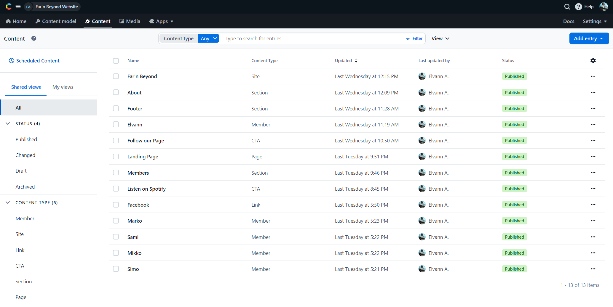

## About This Project

Far'n Beyond is a metal band from Helsinki.  They previously had a Wordpress website that served as a simple landing page, but they needed a redesign, as well as a more cost effective solution for hosting.  The band members also needed a solution that would allow each of them to manage the content by themselves.

In order to save on hosting costs, I decided to host the new website using **Vercel**, and to build using **Contentful** as a headless CMS and **NextJS 13**.

Then the band needed to be able to change the hero section and customize the calls-to-action so they would be able to promote their new releases on their landing page.  **The cover image, titles, descriptions and call to actions are fully customizable** through the **Contentful** interface.  The website's about section is also customizable, as well as the member's list.

## Future Updates

In order to give the band more flexibility and options, I plan on implementing a way for them to create new pages, a contact form section, as well as a blog, and manage pages in the menu above, but for the time being, this current solution fulfills their needs.
