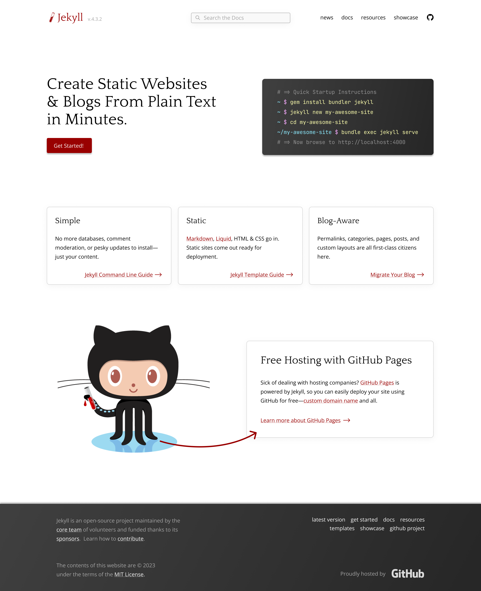
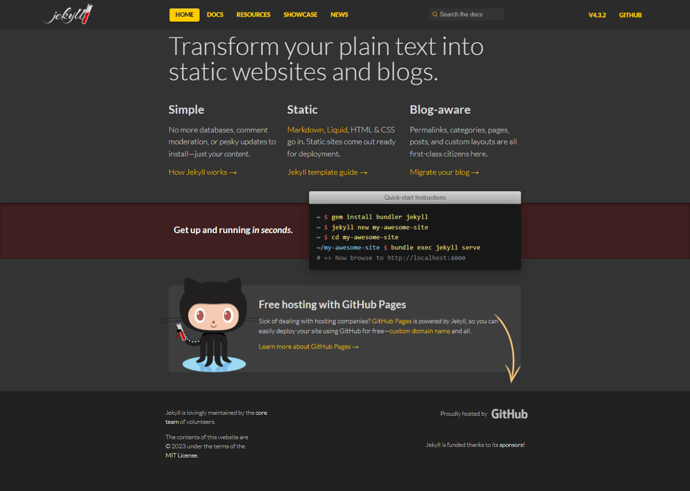
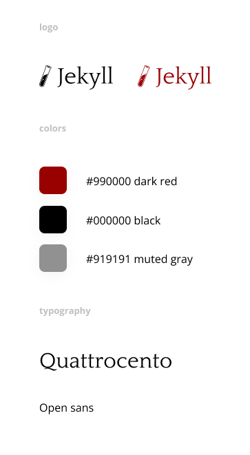
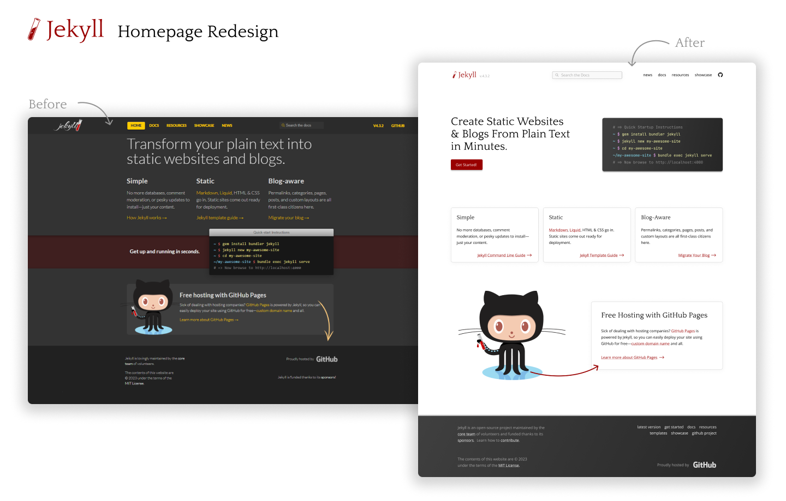

## Project

Jekyll is a largely popular static site generator built on top of Ruby that allows developers to easily create sites using Markdown.  Jekyll is an open source project released under the MIT licence, and has a large community of plugin and theme developers.

The goal of this project is to redesign their documentation website look and experience to make it easier for developers to get started and find the information that they need.

## Challenge

The challenge of this project will be to update Jekyll's homepage to make it align with their brand identity better, and make it easier for users to find the information that they need. The current homepage looks **outdated**, **lacks good visual hierarchy** and **doesn't provide the user with a clear call to action**.

Previous Design:

## Brand Research

Jekyll's user-base are **tech savvy individuals** looking for an easy and quick solution to host their own content online for free.  Their users are likely to be developers and are used to browsing software documentation.  Since Jekyll is a tool aimed for smaller web projects, their target audience are more likely to be individual developers and hobbyists rather than businesses.

The name "Jekyll" was inspired by "The Strange case of Dr Jekyll and Mr Hyde", a story written during the Victorian era and a defining piece of gothic horror literature.  Jekyll's most recognizable visual asset is small red vial which references one of the characters in the story.

Jekyll's brand identity is simple, friendly, modern, and clever.

## Brand Identity Redesign

Jekyll's current website lacks a strong visual identity and looks outdated.  The colors are inconsistent across the website and there is a lack of visual hierarchy reinforced by a lack of negative space and by lack of contrast between different elements of the page.

The new identity will have a much simpler color palette.  Jekyll's roots in  gothic horror makes the initial choice of red a great option for the brand color. Although, a darker and more vibrant shade will elude to gothic horror, while  also being a clever reminder of Ruby as its underlying language.  The use of a light theme for the website will help make the contrast between the primary color and the background more stark.

"Quarttrocento" will be the new typography for the titles and headings, as well as for the brand logo.  This font will pair well with Open Sans for the body.

## Homepage Experience Redesign

The current user experience on Jekyll's website is lacking: there is not clear call to action or clear structure to the page.  

### Top Navigation

The current top navigation is cluttered and its elements lack a coherent visual structure. The software version will be de-emphasized and put next to the logo, the search bar was put in the center, and the pages will be sent to the right.  The "home" menu item will be removed, and the GitHub link will be transformed into an icon.  These changes will help users find the content they're looking for more easily.

### Hero Section 

In order to fix this issue, we will need to redesign the content sections, starting with a hero section that stands out and provides the user with a clear call to action.

Upon landing on the website, user a most likely to be looking to do either of these things:

1. Create their very first Jekyll website
2. Browsing documentation to help them develop using Jekyll.

To help guide users to take these actions, the current headline will be changed to "create static websites & blogs from plain text in minutes", which provides a clearer understanding of what Jekyll is about.  A call-to-action button will be added and will redirect the users to the main content of the website: the documentation section.  The quick startup instructions code block will be made to stand out and will provide first-time users with relevant information.

### Features

Next, the product features will be divided into three cards and provide users will alternative actions to help them get a better understanding of how Jekyll can be used for their project.  The content will stay mostly the same, but the separation and spacing will be improved, making it easier to scan the page.

One of the big features provided by Jekyll of the free and streamlined hosting with GitHub Pages.  The content of the next section section will remain the same, but the design will be cleaned up, and more emphasis will be put on the call to action "Learn more about GitHub Pages" with the use of an arrow.

### Footer

Lastly, the footer's content will remain the same, except for the addition of a secondary navigation menu with items that will provide more choices to the users to help them find what they need.

## Conclusion

The result of this redesign offers a website design that's more in-line with the brand, cleaner, and more easy for users to navigate due to better visual hierarchy all across the board.