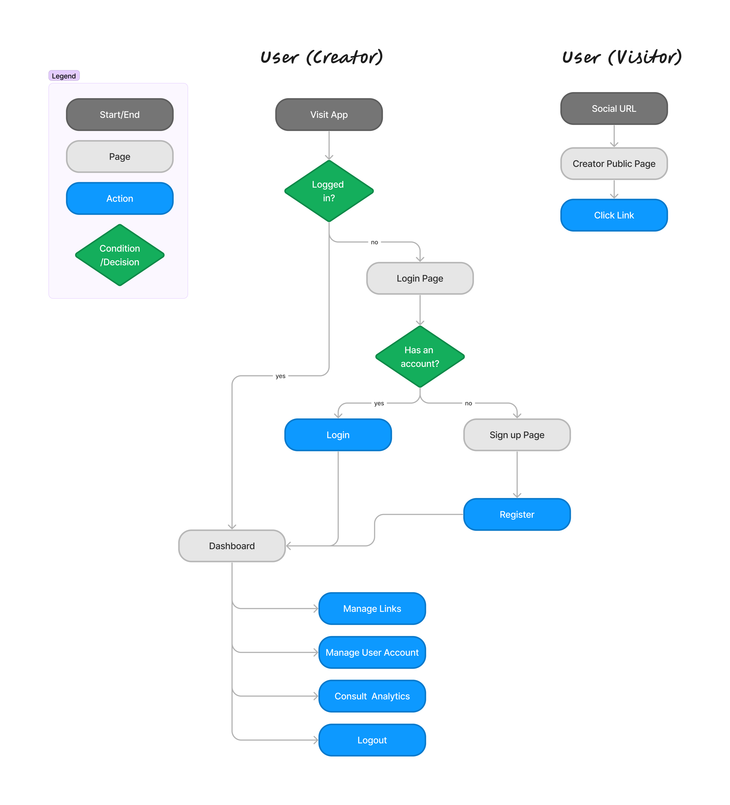
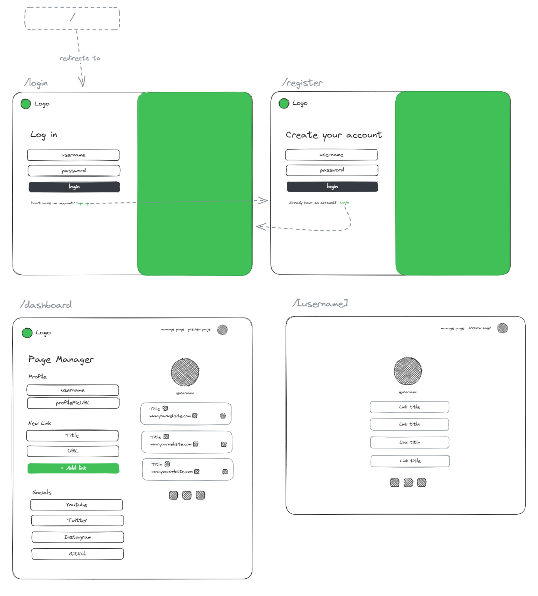
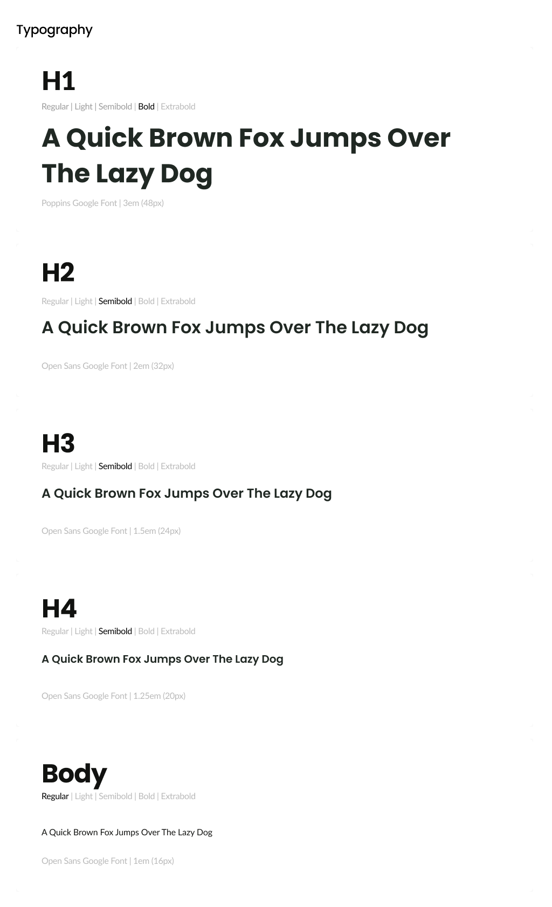
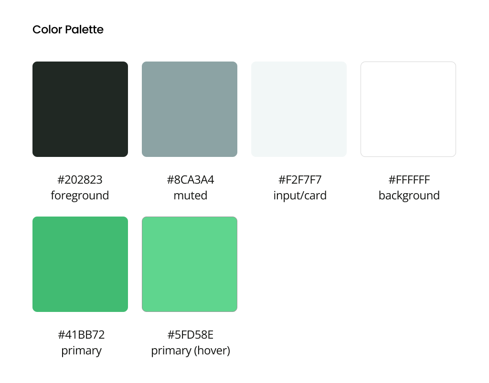
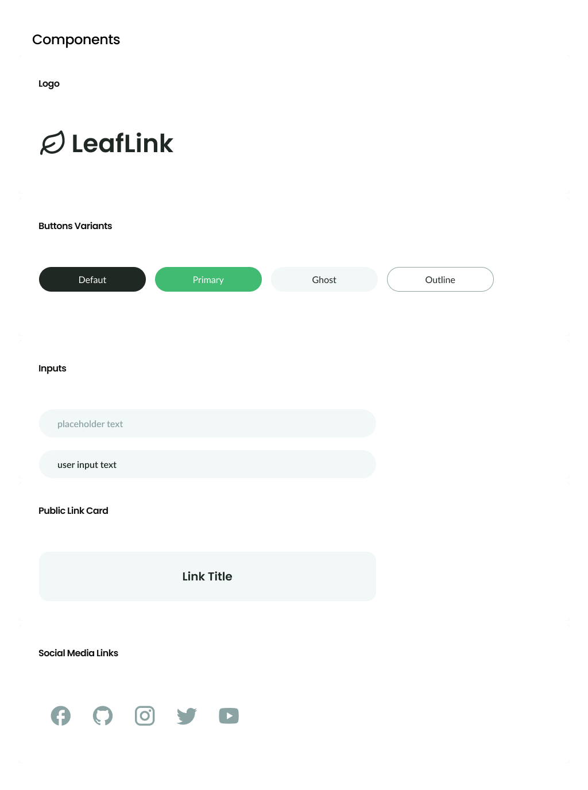
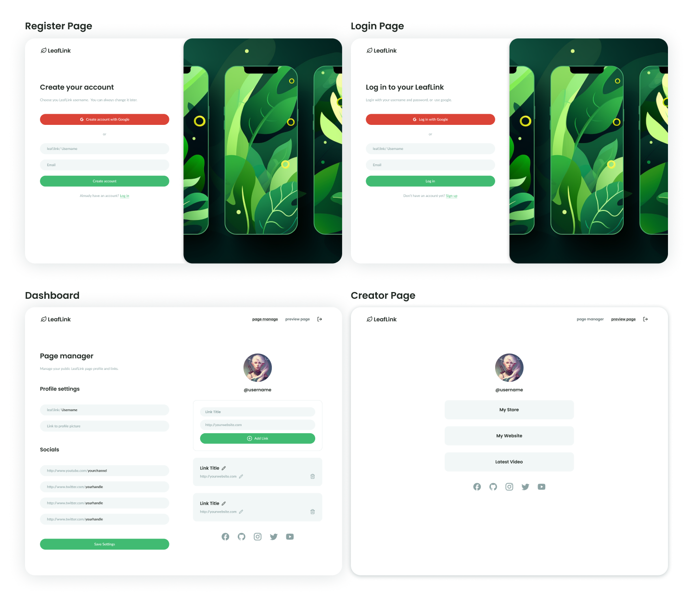

## About this Project

A [Linktree](https://linktr.ee/) clone built using Next, NextAuth, Tailwind & MongoDB.  This project is an learning experiment on how to build a simple, modern fullstack web application using **NextJS 13** and server components.

The goal of this app was to create a simple content management system that allowing users to create an account & login, manage a public page featuring links, and share their public page with the world.

### User Features
- Account Creation & Management
- Profile Customization
- Links Creation & Management
- Basic Statistics: All Times total clicks & most clicked links
- Soft Delete & Archive Page
- Beautiful & Responsive UI

### Technical Features

- **NextJS 13**'& the new `/app` dir,
- Server & Client Components
- API Routes and Middlewares
- Credentials Authentication using **NextAuth.js**
- Database on **MongoDB**
- UI Components built using **Radix UI** & **[shadcn/ui](https://ui.shadcn.com/)**
- Styled using **Tailwind CSS**
- Written in **TypeScript**
- Error Handling & Data Validation using **Zod**
- Beautiful Loading UI & Toaster Notifications
- Forms using debounce for better UX

## Design Considerations

Due to this project being mostly a learning project, I didn't judge necessary to dive into a deep market analysis, although here's a couple of design considerations that guided the development of this project:

- **Quick-to-load public pages:** The speed of loading of public pages is exceptionally important for this project.  Users are content creators mostly using apps such as Instagram and TikTok, and they concerned with getting as many clicks (conversions) as possible.  Fast page load is crucial to ensure a low bounce-rate.
- **Mobile friendly:** It is crucial for this type of application to be as easy to use on mobile as it is on desktop, and especially on the landing page.  Most traffic is expected to come from websites such as Instagram or TikTok, the majority of which are mobile users.
- **Analytics Display**:  Users who make use of these kinds of apps are concerned with keeping tracks of statistics, therefore it would be important to consider adopting analytics features early on, as this might put the app at a serious disadvantage compared to the competition.

### Core Features (MVP)

Before getting started with the wireframes & design, I first identified the core features of this application:

1. Authentication System:
    - Account Creation
    - Login / Logout
2. Managing Personal "Links" collection
    - CRUD operations on the links
    - Display of social media URLs
3. Account Management
    - Updating user information
    - Account Deletion
4. Public Page:
    - View Creator Links
    

**Additional Features**

1. Archive System: Allowing users to "soft" delete links, hence allowing them to keep track of stats easier.
2. Analytics: Allowing the users to track how many clicks each individual link receives

### User Journey

Leaflink will be receiving 2 different types of users:
1. **Creators:** They will be the main users, as they will be responsible to drive traffic to the application.
2. **Visitors:** They will visit the website only briefly form clicking links from they favorite content creators on social media platforms (mainly Instagram and TikTok)

### Initial Low-Fidelity Wireframe

From this user journey map, 4 main screens have been identified:

1. Login
2. Register
3. Dashboard
4. Public Creator Page

For now, the analytics page will be left out of the design.

### Style Guide

## High Fidelity Wireframe

> Note: The original design has received many iterations during developement.  The feel and style have stayed similar, but the layouts have been changed and improved significantly.  Take a look at the [live demo](https://leaflink.vercel.app/) for a more up-to-date version.

## Conclusion & Future Development Ideas

This project reached a state where it has fulfilled its purposes, which was to get familiar with NetJS13, nonetheless, here are a couple features I would like to maybe add in the future:

- [ ] Google Authentication with **NextAuth.js**
- [ ] Theme Customization for user's public page
- [ ] Analytics for page visits & click rates
- [ ] Analytics display for All-times, Year, 30 days & 7 days
- [ ] Adding custom images to links
- [ ] Password Recovery System
- [ ] User's integrating Facebook Pixels & Google Analytics
